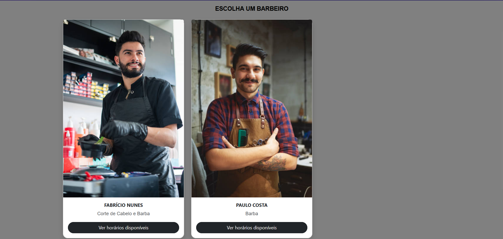
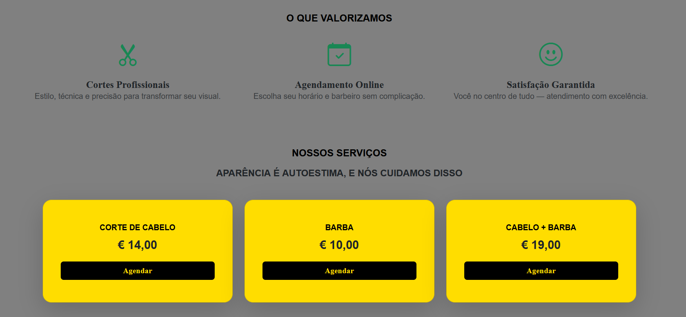
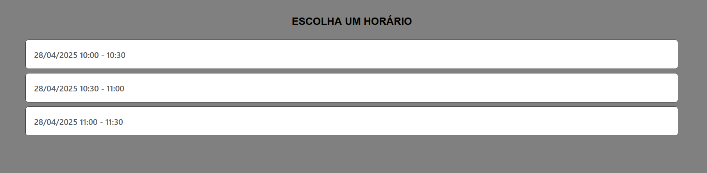
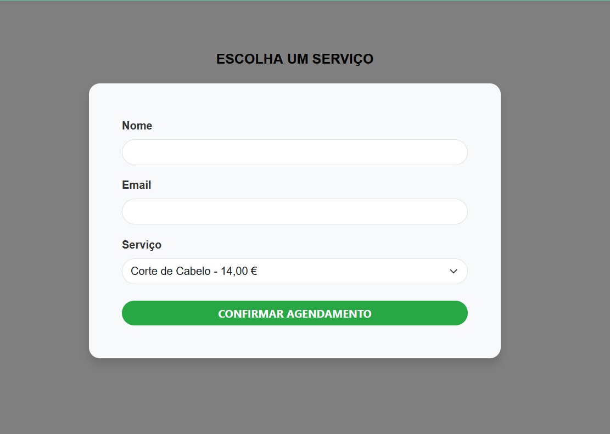
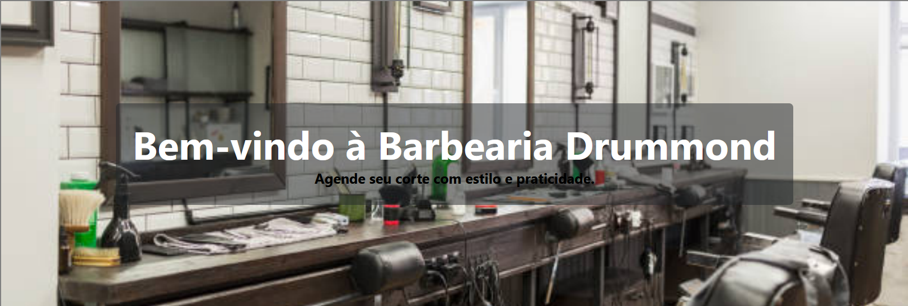
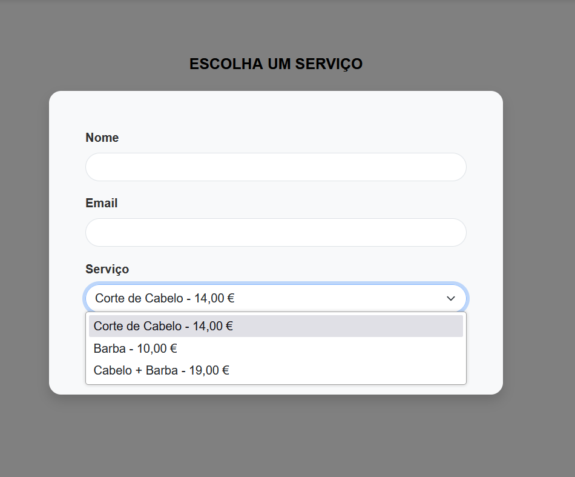

# 🇵🇹 :💈 Sistema de Agendamento Online para Barbearia

Projeto ASP.NET Core MVC que permite clientes agendarem serviços em uma barbearia de forma simples e eficiente.

## 🎯 Objetivo do Projeto

Este sistema foi desenvolvido com o objetivo de treinar o processo de agendamentos em barbearias, oferecendo uma plataforma online onde clientes podem escolher serviços, barbeiros, horários disponíveis e receber confirmação automática via e-mail, além de integração com o Google Calendar.

## 🛠 Funcionalidades

- **Cadastro de barbeiros, serviços e horários disponíveis**  
  A área administrativa permite registrar barbeiros, tipos de serviços oferecidos e seus respectivos horários disponíveis.
  
  
   
  
  
  

- **Agendamento com nome, e-mail e escolha de horário**  
  O cliente preenche um formulário com nome e e-mail e escolhe o serviço e o horário desejado.
  
  

- **Envio de e-mail de confirmação com MailKit**  
  Assim que o agendamento é realizado, o cliente recebe automaticamente um e-mail com os dados da reserva.

- **Criação automática de eventos no Google Calendar**  
  Cada agendamento também é adicionado ao calendário da barbearia, ajudando no controle de horários e evitando conflitos.

- **Interface responsiva com Bootstrap e Tailwind CSS**  
  A UI foi pensada para funcionar bem em diferentes tamanhos de tela.
    
  
  
  

---

## ⚠️ Aviso Importante

Caso nenhum horário estiver sendo exibido ao tentar agendar, isso pode ser porque todos os horários do dia atual já passaram.  
Faça login como **administrador** para cadastrar novos horários disponíveis:

- **Email:** `admin@barbearia.com`  
- **Senha:** `Admin123!`

---

## ⚙️ Tecnologias Utilizadas

- ASP.NET Core MVC
- Entity Framework Core
- SQL Server
- MailKit
- Google Calendar API
- Bootstrap + TailwindCSS

---

## 🚀 Configurando e Executando o Projeto

---

### 1. Pré-requisitos
1. Instale o [.NET SDK](https://dotnet.microsoft.com/download) (versão 6 ou superior).
2. Instale o [SQL Server Express](https://www.microsoft.com/sql-server/sql-server-downloads) ou outra instância do SQL Server.
3. Instale o [SQL Server Management Studio (SSMS)](https://learn.microsoft.com/sql/ssms/download-sql-server-management-studio-ssms) para gerenciar o banco de dados (opcional, mas recomendado).

### 2. Clone o repositório

```bash
git clone https://github.com/BeCrista/BarberShop.git
```

- Abra o projeto no Visual Studio ou outro editor compatível com ASP.NET Core.

- Execute o projeto. O servidor será iniciado e você poderá visualizar o aplicativo no navegador.

### 3. Configure a Base de Dados

- Anexe os arquivos `.mdf` e `.ldf` da pasta `Database` ao seu SQL Server
- No `appsettings.json`, ajuste a connection string:

```json
"ConnectionStrings": {
  "DefaultConnection": "Server=(localdb)\\mssqllocaldb;Database=Barbearia;Trusted_Connection=True;"
}
```

### 4. Configuração do Projeto

1. Abra o terminal e navegue até o diretório do projeto:
   ```bash
   cd Barbearia
2. Atualize o arquivo appsettings.json (se necessário):
   - Certifique-se de que a string de conexão está configurada corretamente para o SQL Server local.
3. Execute o projeto:
```bash
  dotnet watch run
```

---

## ✉️ Configuração de Email (MailKit)

No `appsettings.json`, edite a seção `EmailSettings`:

```json
"EmailSettings": {
  "From": "seuemail@exemplo.com",
  "SmtpServer": "smtp.gmail.com",
  "Port": "587",
  "Username": "seuemail@exemplo.com",
  "Password": "senhaouSenhaDeAplicativo"
}
```

> Se usar **Gmail**, ative a autenticação em dois fatores e gere uma senha de aplicativo.

Na classe `EmailSender`, adicione seu e-mail como cópia oculta:

```csharp
emailMessage.Bcc.Add(MailboxAddress.Parse("seuemail@exemplo.com"));
```

---

## 📅 Integração com Google Calendar

1. Crie um projeto no [Google Cloud Console](https://console.cloud.google.com)
2. Ative a **Google Calendar API**
3. Crie uma **conta de serviço** e baixe a chave JSON
4. Coloque a chave no projeto e configure em `GoogleCalendarService.cs`
5. Compartilhe o calendário com a conta de serviço
6. No `AgendamentosController`, insira o ID do seu calendário:

```csharp
string calendarId = "SEU_ID_DO_CALENDARIO";
```

---

## 📥 Contribuição

Fique à vontade para abrir uma issue ou PR com sugestões, correções ou melhorias!

---

## 📜 Licença

Projeto licenciado sob a licença MIT.

---

# 🇺🇸 :💈 Online Scheduling System for Barber Shops

ASP.NET Core MVC project that allows customers to schedule services at a barber shop in a simple and efficient way.

## 🎯 Project Objective

This system was developed with the aim of training the scheduling process in barber shops, offering an online platform where customers can choose services, barbers, available times and receive automatic confirmation via email, in addition to integration with Google Calendar.

## 🛠 Features

- **Registration of barbers, services and available times**
The administrative area allows you to register barbers, types of services offered and their respective available times.


- **Schedule with name, email and time selection**
The client fills out a form with name and email and chooses the desired service and time.


- **Sending confirmation email with MailKit**
As soon as the schedule is made, the client automatically receives an email with the reservation details.

- **Automatic creation of events in Google Calendar**
Each schedule is also added to the barbershop calendar, helping with schedule control and avoiding conflicts.

- **Responsive interface with Bootstrap and Tailwind CSS**
The UI was designed to work well on different screen sizes.


---

## ⚠️ Important Notice

If no time is displayed when trying to schedule, this may be because all the times for the current day have already passed. Log in as **administrator** to register new available times:

- **Email:** `admin@barbearia.com`
- **Password:** `Admin123!`

---

## ⚙️ Technologies Used

- ASP.NET Core MVC
- Entity Framework Core
- SQL Server
- MailKit
- Google Calendar API
- Bootstrap + TailwindCSS

---

## 🚀 Setting Up and Running the Project

---

### 1. Prerequisites
1. Install the [.NET SDK](https://dotnet.microsoft.com/download) (version 6 or higher).
2. Install [SQL Server Express](https://www.microsoft.com/sql-server/sql-server-downloads) or another instance of SQL Server.
3. Install [SQL Server Management Studio (SSMS)](https://learn.microsoft.com/sql/ssms/download-sql-server-management-studio-ssms) to manage the database (optional, but recommended).

### 2. Clone the repository

```bash
git clone https://github.com/BeCrista/BarberShop.git
```

- Open the project in Visual Studio or another ASP.NET Core-compatible editor.

- Run the project. The server will start and you will be able to view the application in the browser.

### 3. Configure the Database

- Attach the `.mdf` and `.ldf` files from the `Database` folder to your SQL Server
- In `appsettings.json`, adjust the connection string:

```json
"ConnectionStrings": {
"DefaultConnection": "Server=(localdb)\\mssqllocaldb;Database=Barbearia;Trusted_Connection=True;"
}
```

### 4. Project Configuration

1. Open the terminal and navigate to the project directory:
```bash
cd Barbearia
2. Update the appsettings.json file (if necessary):
- Make sure the connection string is configured correctly for the local SQL Server.
3. Run the project:
```bash
dotnet watch run
```

---

## ✉️ Email Configuration (MailKit)

In `appsettings.json`, edit the `EmailSettings` section:

```json
"EmailSettings": {
"From": "youremail@example.com",
"SmtpServer": "smtp.gmail.com",
"Port": "587",
"Username": "youremail@example.com",
"Password": "passwordorAppPassword"
}
```

> If you use **Gmail**, enable two-factor authentication and generate an app password.

In the `EmailSender` class, add your email as a blind copy:

```csharp
emailMessage.Bcc.Add(MailboxAddress.Parse("youremail@example.com"));
```

---

## 📅 Integration with Google Calendar

1. Create a project in the [Google Cloud Console](https://console.cloud.google.com)
2. Enable the **Google Calendar API**
3. Create a **service account** and download the JSON key
4. Place the key in the project and configure it in `GoogleCalendarService.cs`
5. Share the calendar with the service account
6. In the `AgendamentosController`, insert your calendar ID:

```csharp
string calendarId = "YOUR_CALENDAR_ID";
```

---

## 📥 Contribution

Feel free to open an issue or PR with suggestions, corrections or improvements!

---

## 📜 License

Project licensed under the MIT license.
